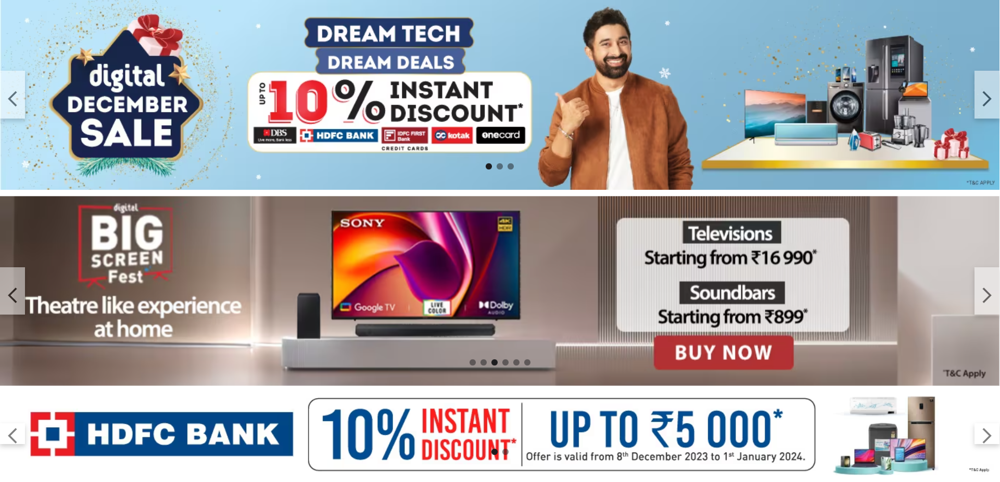
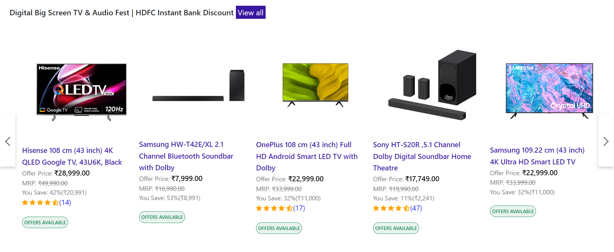
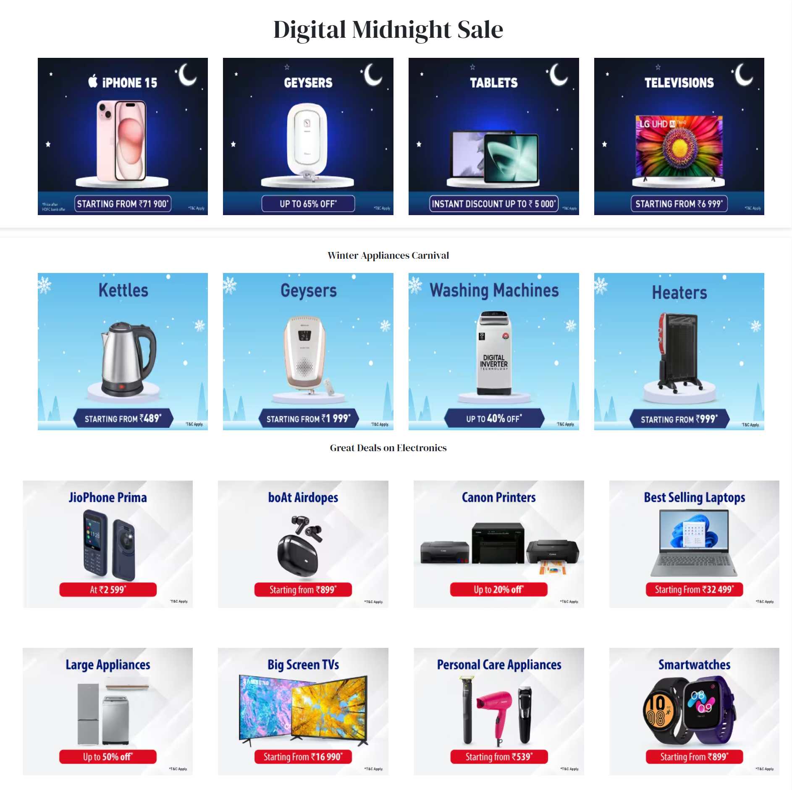
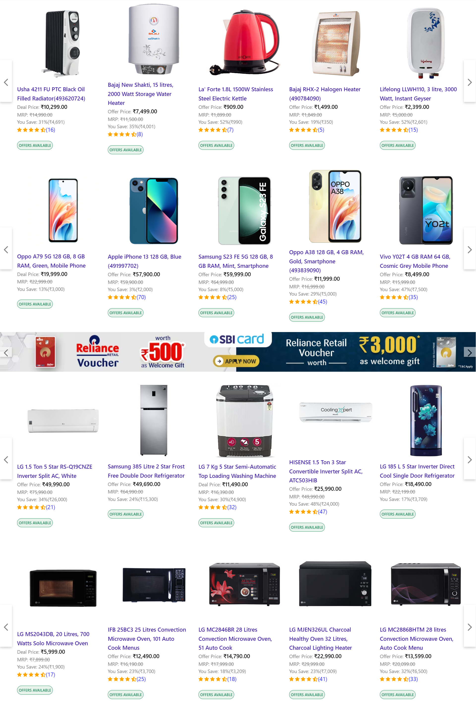
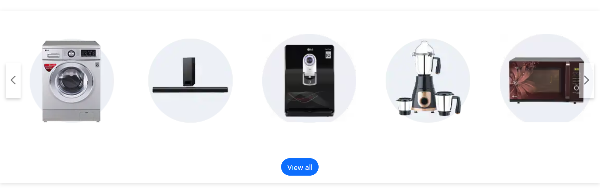
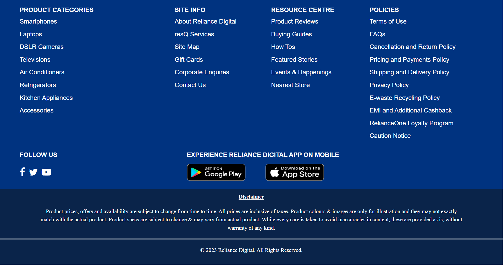

# Reliance Digital Clone Project


## Group Name

Code Wizard

## Team Members

- **Team Lead**: [Md Azad Ansari (fw29_024)]
- **Frontend Developers**:
  1. [Supriya Hatele (fw28_263)]
  2. [Pavan Kumar Vasantha (fw29_032)]
  3. [Ravi Mishra (fw29_126)]
  4. [Gaurav Dorle (fw28_199)]

## Project Duration

4 days
## Overview

This project is a clone of the landing page of Reliance Digital, a leading electronics retail chain. The clone was created by a team of 5 members within a timeframe of 4 days. The project aimed to replicate the essential features and design elements of the original Reliance Digital landing page using HTML, CSS, and Bootstrap. The collaborative effort was spearheaded by the group named "Code Wizard."

Preview the live template here: Wizard Group Live Demo  : https://wizard-bootstrap-reliance-digital.netlify.app/ 

Prerequisites
A modern web browser
A text editor (e.g., VS Code, Sublime Text)
Basic knowledge of HTML/CSS and SASS
Installation
Clone the repository or download the ZIP to your local machine.
Unzip the file if you've downloaded it as a ZIP.
Open the folder in your text editor.
Use a SASS compiler to compile the .scss files to .css or edit the CSS directly.
Open the index.html file in your web browser to view the template.

# Features

The Reliance Digital Clone project includes the following features, mirroring the functionality and design of the original landing page:


1. Header and Navigation: The top navigation bar is a crucial element of the landing page, offering users intuitive access to various sections. We faithfully reproduced this feature to ensure a seamless and familiar browsing experience.

2. Product Carousel :Our team successfully implemented a dynamic product carousel, allowing users to easily browse through a selection of featured products. Our dynamic product carousel not only showcases featured products but also includes smooth transition effects and responsive design. Users can effortlessly navigate through a visually appealing display of products.

3. Product Categories: The website includes sections for various product categories, In addition to featuring popular brands, our project incorporates a search functionality within the brands section. Users can quickly find their preferred brands, making the browsing experience more efficient.

4. Footer :Our project includes a comprehensive footer featuring links to the company's social media profiles. This mirrors the original website's commitment to maintaining an active online presence and engaging with customers on social platforms.

# Screenshots


## Header and Navigation




## Product Carousel

### Products


### Sales


## Product Categories

### Items Carousels



### Product Categories




## Footer 



## Getting Started

To view the Reliance Digital Clone locally, follow these steps:

1. Clone the repository:

   ```bash
   https://github.com/azadanshu/code-wizard-8765-figma-/tree/main/Reliance%20digital%20project
   ```

2. Open the `index.html` file in your preferred web browser.

3. Explore the clone and compare it with the original Reliance Digital landing page.


## Technologies Used

- HTML
- CSS
- Bootstrap


## Acknowledgments

- The Code Wizard team would like to express gratitude to Reliance Digital for providing an inspiring design for educational purposes.
- Special thanks to Bootstrap for simplifying the development of a responsive and visually appealing user interface.
Feedback, contributions, and suggestions are welcome! Feel free to enhance and customize this project further.

# Linkedin-Profiles
 <a href="https://www.linkedin.com/in/md-azad-ansari-b08196218" target="_parent">Azad</a> 
 
 <a href="https://www.linkedin.com/in/supriya-hatele-b0696b1bb" target="_parent">Supriya</a>
 
 <a href="https://www.linkedin.com/in/pavankumar25/" target="_parent">Pavan</a>
 
 <a href="https://www.linkedin.com/in/ravimishra007" target="_parent">Ravi</a>

